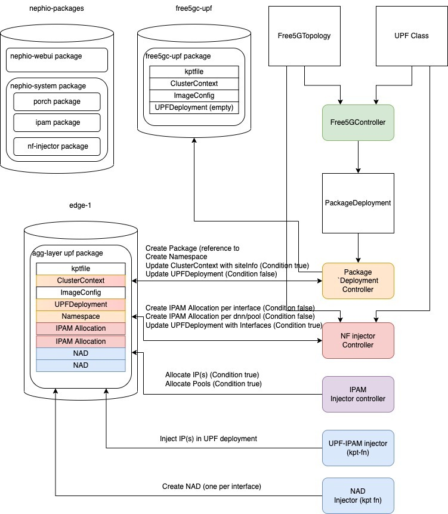

# ONE Summit 2022 Nephio Workshop

Welcome! Each participant has been provisioned a VM with a complete
simulated multi-cluster environment with the Nephio proof-of-concept code
already pre-installed, as shown in the diagram below.


More details are available on the [participant VM](participant-vm.md)
page.

## Accessing Your Environment

The organizers will provide you with an IP address for your VM and the ssh
private key that can be used to login to the machine. You will need an ssh
client capable of port forwarding and a browser to participate in the workshop.

For the workshop exercises, you will be using both the prototype Web UI and
various `kubectl` commands run on your participant VM. To access your environment,
you will start an ssh session that will all your local laptop to access the Web
UI running in the Nephio cluster on the VM.

In all the commands below, `$IP` is the public IP address of your workshop
participant VM.

To use the UI, you need to forward ports from your workstation to the VM, and
from the VM to the Pod. The instructions below work on Linux and Mac; you will
need to consult the docs of your ssh client if you are using a Windows
machine.

```bash
# login from your workstation, forwarding 7007 -> localhost:7007 on the remote VM.
ssh -L7007:localhost:7007 -i ~/.ssh/nephio ubuntu@$IP
# now you are in the remote VM, in there run
kubectl --kubeconfig ~/.kube/nephio.config port-forward --namespace=nephio-webui svc/nephio-webui 7007
```
On your workstation you can now browse to the URL
[http://localhost:7007](http://localhost:7007), and you should see something
like the image below.


You will need to leave the port forwarding up and running in that ssh session.
So, for `kubectl` access, you need to start a second ssh session, this time
without any port forwarding. This will be used for all the CLI access to the
clusters running on the participant VM. Create a new terminal window or tab on
your laptop and run:

```bash
ssh -i ~/.ssh/nephio ubuntu@$IP
```

You can then check if you our cluster is working with `kubectl`:

```bash
ubuntu@nephio-poc-001:~$ kubectl --kubeconfig ~/.kube/nephio.config -n nephio-system get pods
NAME                                                        READY   STATUS    RESTARTS   AGE
ipam-controller-65fb5fc8d4-5m8ts                            2/2     Running   0          24m
nephio-5gc-controller-594cfd86b8-c9vbf                      2/2     Running   0          24m
nf-injector-controller-66f885d554-b6pqq                     2/2     Running   0          24m
package-deployment-controller-controller-785688cb75-nnbvt   2/2     Running   0          24m
ubuntu@nephio-poc-001:~$
```

## Custom Resources and Controllers

A *Custom Resource Definition* or *CRD* is a Kubernetes extension mechanism for
adding custom data types to Kubernetes. The CRDs are the schemas - analogous to
table definitions in a relational database for example. The instances of those -
analogous to rows in a RDBMS - are called *Custom Resources* or *CRs*. People
often accidentally say "CRDs" when they mean "CRs", so be sure to ask for
clarification if the context doesn't make it clear which is meant.

In Kubernetes, resources - built-in ones as well as CRs - are processed by
*controllers*. A controller *actuates* the resource. For example, K8s
actuates a Service with Type LoadBalancer by creating a cloud provider
load balancer instance. Since Kubernetes is
*declarative*, it doesn't just actuate once. Instead, it actively reconciles
the intent declared in the resource, with the actual state of the managed
entity. If the state of the entity changes (a Pod is destroyed), Kubernetes will
modify or recreate the entity to match the desired state. And of course if the
intended state changes, Kubernetes will actuate the new intention. Speaking
precisely, a *controller* manages one or a few very closely related types of
resources. A *controller manager* is single binary that embeds multiple
controllers, and an *operator* is a set of these that manages a particular type
of workload. Speaking loosely, *controller* and *operator* are often used
interchangeably, though an *operator* always refers to code managing CRs rather
than Kuberenetes built-in types.

All Kubernetes resources have a *metadata* field that contains the name,
namespace (if not cluster scoped), annotations and labels for the resource. Most
resources also have a *spec* and a *status* field. The *spec* field holds the
intended state, and the *status* field holds the observed state and any control
data needed by the controller to do its job. Typically, controllers read the
spec and write the status.

## Packages

*Packages* or *Kpt Packages* are bundles of Kubernetes resource files, along
with a Kptfile (also in Kubernetes Resource Model or KRM format). They provide
the basic unit of management in the Kpt toolchain. This toolchain is used to
manage the configuration before it reaches the Kubernetes API server. This
"shift left" model is critical to allowing **safe** collaborative, automated
configuration creation and editing, because errors or partial configurations can
be resolved prior to affecting operations.

Following the configuration-as-data principle, the package is not encapsulated.
Since the contents of the package is simply KRM resources, independently
designed tools and automations can operate on those resources. Instead of an
encapsulated abstract interface where inputs are provided and manifests are
rendered, we have an open concept we refer to as "the package is the
interface".

In order to allow multiple actors to operate on that open package safely, we
mediate the process via an API layer called *Porch* (for "**P**ackage
**Orch**estration). Porch provides a Kubernetes API for manipulating packages,
their contents, and how they map to repositories (which may be Git or OCI
repositories).

In Porch, packages always live within a repository. A package may have many
*package revisions*, or versions of the package, within the same repository. A
*draft* package revision lives in a draft branch, not in the main branch. When a
draft is ready to be used, it may be *proposed* for publication. If the proposed
draft is *approved* it becomes a *published* revision, and is assigned a
revision number by Porch. Published packages are tagged in the underlying
repository. A given package can have many revisions, but they are all
sequentially ordered as "v1", "v2", "v3", etc. This version is the revision
number of the configuration package, not the underlying software contained in
the package. This simple sequential numbering makes it easier to do automatic
discovery of configuration package updates.

There are a few different techniques we have for manipulating the content of
packages. The simplest and most basic is to just edit the files. Since the
"package is the interface", it is perfectly fine to simply edit files within
the package directly, and save them. The fact that the package is all KRM data
makes it relatively easy to merge upstream changes with downstream changes.

The next simplest is with *KRM functions*, also known as *kpt functions*. This
are small pieces of reusable code that perform a single purpose in manipulating
the configuration. When executed, a KRM function typically is provided with all
of the resources in the package, and modifies them however it needs to, and then
emits the updated list as output. A KRM function can be called *imperatively*,
by simply executing it against the package. This can be used, for example, with
the `search-and-replace` function to do a one-time change across many resources
in a package. Or, a KRM function can be setup in the Kptfile to be called
*declaratively*; it will be called every time Porch saves the package. This is
useful for functions that want to make sure information is consistent across
several resources within a package. For example, the `set-namespace` function
can be used to ensure the namespace is set correctly across all resources in a
package, even if a new resource is added later.

Functions are intended to be simple, and *hermetic*. This means they do not
reach out to other systems to gather information. They do not have network
access nor can they mount volumes. Instead, they simply take the inputs provided
in the package resources, and modify or generate other resources based on those.

Sometimes in order to create a re-usable function, that function will need
inputs. For simpler functions, inputs are captured via `ConfigMap` resources
within the Kptfile directly. For more complex function inputs, a
function-specific custom resource can be used. These resources though only live
within the package; we do not want them actually pushed to the cluster when we
deploy the package. To avoid that, we add a special annotation on the resources,
`config.kubernetes.io/local-config: "true"`. We thus often refer to these types
of resources as "local config" resources.

Stepping up the power and complexity level, the fact that Porch is a Kubernetes
API service means that we can build Kubernetes controllers on top of it. This is
exactly what we are doing in Nephio. The *Package Deployment Controller* is a
controller that takes a specific package along with a cluster selector, and
creates individual downstream versions of the package, customized for each
cluster. We often refer to this process of creating many downstream package
variants from a single upstream package as "fan out".

The actual method of creating those customizations on a per-cluster basis is
done via something we call *config injection*. This means that the package
expects some information to come from outside the package, based upon the
context where the package is being deployed. To make this work, the package
needs to "advertise" the configuration injection points. We do this with
"local config" resources. A package can contain a stub or placeholder resource,
which can be tagged with the annotation `automation.nephio.org/config-injection:
"true"`. This indicates that the package expects that a controller or other user
may want to replace the *spec* of the resource with some other data.

When the package deployment controller runs, it does a very simple injection
during the downstream package creation process. It looks through the package
resources for any injection points. For each one it finds, it looks for a
corresponding resource in the management cluster with the group, version, and
kind of the in-package resource, but the name of the target cluster. If it finds
one, it copies (*injects*) the spec from the in-cluster resource into the
in-package resource. For example, if the package contains a `ClusterContext`
resource with spec that includes a placeholder `SiteCode` value, the package
deployment controller will replace that spec with the one specific to the target
cluster, thereby making the cluster-specific `SiteCode` accessible to any KRM
functions that run within the package.

As an observer, you need to know whether or not this injection was successful,
because until we know all the injections are done, we do not know if the package
is fully ready for deployment. To facilitate this, the package deployment
controller creates a *package status condition* for each injection point. Status
conditions are used within Kubernetes to allow multiple controllers to interact
with a resource independently; we have modeled *package* status conditions after
this.

These conditions are also how *other* controllers know whether to modify a
package or not. Other controllers watch for draft package revisions that have
specific types of conditions set to "false". When they find a type of condition
they manage, they will execute their logic and inject the result into the
package. This is the means by which multiple actors can coordinate in modifying
a package, without interferring with one another.

### Package Ancestry

A package may have a single *upstream* parent, and many *downstream*
descendants. The Kptfiles in these packages are used to maintain the
relationships, capturing ancestry relationships like those shown below.


By tracking these relationships, changes at the original source can be
propagated via controlled automation down the tree.

### Package Configuration Journey


## Excercises

The environment you start with is a "blank slate". It has all the components of
the Nephio PoC installed, but does not have network functions and operators
installed.

Today, we will see two different ways of managing workloads in a Nephio-based
platform. The first will follow a traditional "operator" model. In this model,
we run an operator on the edge clusters, which processes a CR specific to that
operator. In doing so, it creates the Kubernetes resources needed to run that
workload. The second is a "shift left" model, in which the Kubernetes resources
needed to run the workload are generated on the management cluster, in the
configuration storage, without any need to run an operator on the workload
cluster. Both of these are valid and have their pros and cons, and both will be
needed in a real world deployment.

For the operator model example, we will use the free5gc UPF. For the shift-left
model, we will use a caching DNS instance. We had intended to use the SMF and a
future version of this workshop will do so, but unfortunately it is not
available yet.

Starting with the UPF journey, here is what you will do:
1. Create an organizational version of the free5gc operator package
1. Deploy that package across the edge clusters
1. Configure a `FiveGCoreTopology` resource that contains the UPF configuration
   that is invariant across the set of clusters.
1. Observe how the system interacts to fully fill out the configuration,
   constructing the `UPFDeployment` custom resource.
1. Publish the package so that the `UPFDeployment` gets delivered to the edge
   clusters.
1. Observe how the free5gc operator running in the edge cluster picks up the
   `UPFDeployment` and uses it to render a `ConfigMap` and `Deployment`
   resource, thus running the free5gc UPF.

For the caching DNS journey, here is the overview:
1. Create an organizational version of the caching DNS package.
1. Deploy that package across all of the workload clusters.
1. Observe how the system customizes the package for each cluster.
1. Publish the package to the workload clusters.
1. Observe the running package in the clusters.
1. Create a new, updated version of your caching DNS package.
1. Observe how the system discovers that an upgrade is available.
1. Upgrade and publish the package to a workload cluster.

### Create an Organizational Version of the free5gc Operator Package
Part of the idea of Nephio is to help manage the relationship between vendor,
organizational, team, and individual deployment variants of each package.

Let's create our own organizational variant of the upstream free5gc package,
using the Web UI.

* From the **Dashboard**, choose the *catalog* link under **Organizational
Blueprints**. This represents the private catalog of packages that have been
customized for your organization.
* In the resulting screen, push the **ADD ORGANIZATIONAL BLUEPRINT** button.
* In the **Add Organizational Blueprint** screen:
    * Choose "Create a new organizational blueprint by cloning an external
      blueprint".
    * Choose "free5gc-packages".
    * Choose "free5gc-operator".
    * Click Next
    * Click Next in the Metadata section.
    * Click Next in the Namespace section.
    * Click Next in the Validate Resources section.
    * Click the **CREATE ORGANIZATIONAL BLUEPRINT** button.
* The next screen is the package editor, for the new, *Draft* package you have
  just created. In order to make it available for deployment, we need to publish
  it.
    * Click the **PROPOSE** button.
    * It will change to **APPROVE** momentarily. Click that button.
    * Note: there is an occasional issue where you will see an "Internal error".
      This is a known bug. Just refresh the page and try again.
* You can click back on the *Package Management* link to go back to the
  **Dashboard**, where you will see your new package is available as an
  organizational blueprint.

### Deploy the free5gc Operator
We can use a `PackageDeployment` resource to create a multi-cluster deployment
across all edge clusters of our customized `free5gc-operator` package.

We have UI screen to do this.

* From the **Dashboard**, clicke the **MANAGE PACKAGES ACROSS CLUSTERS** button.
* Click the **ADD PACKAGE DEPLOYMENT** button.
* Choose "Deploy a organizational blueprint across a number of clusters".
* Choose "catalog" for the *Source Organizational Blueprint Repository*.
* Choose "free5gc-operator" for the *Package Reference*.
* Click Next
* Choose "us-central1" for the *Region*.
* Leave *Site* blank.
* Choose "edge" for the *Site Type*.
* Click Next
* Click Next in the Metadata section
* Click the **CREATE PACKAGE DEPLOYMENT** button.

After a few minutes, you should see the package in Draft form on each edge
cluster. For each of these, click on the package to go to the package editor
screen, **PROPOSE** and **APPROVE** to push the actual packages to the edge
clusters.

### Deploy a `FiveGCoreTopology`
The edge clusters are now ready to receive `UPFDeployment` resources that can be
used to run the UPF workloads.

Rather than manually creating those, we are going to use another controlling
resources, called a `FiveGCoreTopology` resource. The idea of this resource
(which is incomplete at this time), is that it represents configurations of your
5g core network functions in a cluster-neutral way, as well as how those
functions interrelate, and a selector for the clusters that should run that
function configuration.  Right now, only the UPF portion is working.

Save the YAML below in a file, `topo.yaml` on your participant
VM:

```bash
cat > topo.yaml
(copy and paste the YAML, then type Control-D to close the file)
```

```yaml
apiVersion: nf.nephio.org/v1alpha1
kind: FiveGCoreTopology
metadata:
  name: fivegcoretopology-sample
spec:
  upfs:
    - name: "agg-layer"
      selector:
        matchLabels:
          nephio.org/region: us-central1
          nephio.org/site-type: edge
      namespace: "upf"
      upf:
        upfClassName: "free5gc-upf"
        capacity:
          uplinkThroughput: "1G"
          downlinkThroughput: "10G"
        n3:
          - networkInstance: "sample-vpc"
            networkName: "sample-n3-net"
        n4:
          - networkInstance: "sample-vpc"
            networkName: "sample-n4-net"
        n6:
          - dnn: "internet"
            uePool:
              networkInstance: "sample-vpc"
              networkName: "ue-net"
              prefixSize: "16"
            endpoint:
              networkInstance: "sample-vpc"
              networkName: "sample-n6-net"
```

Then, you can deploy it with:

```bash
kubectl --kubeconfig ~/.kube/nephio.config apply -f topo.yaml
```

What does the system do with this resources?

1. It generates a `PackageDeployment` resource to fan out the
   `free5gc-upf` package across the edge clusters, by following the
   *upfClassName* to the "free5gc-upf" `UPFClass`, which in turn contains a
   package reference.
1. That package includes two "local config" objects (discussed above), one for
   the `ClusterContext` and one for the `UPFDeployment` itself.
1. The package deployment controller will inject the `ClusterContext`, which you
   can see in the *Conditions* tab of a free5gc-upf package instantiated by this
   process.
1. The `UPFDeployment` cannot be injected by the package deployment controller,
   but instead needs another controller, the *nf injector controller* to create
   it. That controller will see the `false` condition of the
   `UPFDeployment` condition type, and it will use the UPF configuration
   information from the `FiveGCoreTopology` resource, along with information from
   the injected `ClusterContext`, to generate the skeleton of
   the `UPFDeployment`. However, it doesn't know how to allocate IP addresses.
   Instead, it will generate new, local config resources of type
   `IPAMAllocation`, and associated package conditions set to `false`.
1. The *IPAM injector* will see these new package conditions, and will use the
   information in them to request IP addresses from the *IPAM controller*,
   storing those IPs back into the *status* field of the `IPAMAllocation`.
1. A kpt function, *nephio-ipam-upf-fn*, that is included in the *Kptfile*'s
   pipeline, will copy the IP addresses from the *status* to the right places in
   the `UPFDeployment`.
1. Another kpt function, *nad-inject-fn*, will generate the Multus
   `NetworkAttachmentDefinition` resources using information from the
   `IPAMAllocation` resources.

The diagram below shows this interaction.



You can observe this by watching how the package automatically progresses
through conditions. You will need to refresh your browser page on the package
editor screen for the `agg-layer-upf` deployment.

Once all the conditions go green, you can **PROPOSE** and **APPROVE** the
package, delivering the completed `UPFDeployment` to the edge cluster. Then, you
can check to see that the `UPFDeployment` is delivered to the edge cluster, and
that the operator has created the associated `ConfigMap` and `Deployment`:

```bash
kubectl --kubconfig ~/.kube/edge-1.config -n upf get deploy,cm,network-attachment-definition,upfdeployment,po
```

Unfortunately, we did not *quite* get there with aligning our configuration with
what is there in the Multus configuration of the underlying clusters. So, the
`Pod` will be stuck in `ContainerCreating`. Of course, if the underlying
infrastructure were provisioned by Nephio, too, then this wouldn't happen...


### Manage a Package Upgrade

- Create a catalog version of the caching-dns-scaled package.
- Create a Package Deployment for it across all workload clusters
- Make a change to the catalog package, resulting in a new package revision
- The UI will identify that downstream packages have an upgrade available
- Use the UI to upgrade the packages


## Troubleshooting and Utility Commands

This is all prototype code. It is not anywhere near production ready. As such,
it sometimes behaves badly. This section gives a few commands that are useful in
resetting your environment.


### Restarting Controllers

```bash

# Restart each controller
kubectl --kubeconfig ~/.kube/nephio.config -n nephio-system rollout restart deploy package-deployment-controller-controller
kubectl --kubeconfig ~/.kube/nephio.config -n nephio-system rollout restart deploy nephio-5gc-controller
kubectl --kubeconfig ~/.kube/nephio.config -n nephio-system rollout restart deploy ipam-controller
kubectl --kubeconfig ~/.kube/nephio.config -n nephio-system rollout restart deploy nf-injector-controller

# Check to see if the restart is done
kubectl --kubeconfig ~/.kube/nephio.config -n nephio-system get po
```

### Viewing Controller Logs

```bash
# PackageDeployment controller
kubectl --kubeconfig ~/.kube/nephio.config -n nephio-system logs -c controller -l app.kubernetes.io/name=package-deployment-controller

# FiveGCoreTopologyController
kubectl --kubeconfig ~/.kube/nephio.config -n nephio-system logs -c controller -l app.kubernetes.io/name=nephio-5gc

# NF Injector
kubectl --kubeconfig ~/.kube/nephio.config -n nephio-system logs -c controller -l app.kubernetes.io/name=nf-injector

# IPAM controller
kubectl --kubeconfig ~/.kube/nephio.config -n nephio-system logs -c controller -l app.kubernetes.io/name=ipam
```

### Restarting the Web UI

```bash

# Restart the deployment
kubectl --kubeconfig ~/.kube/nephio.config -n nephio-webui rollout restart deploy nephio-webui

# Check if the restart is complete

kubectl --kubeconfig ~/.kube/nephio.config -n nephio-webui get po
```

### Cleaning Up Everything

```bash

# Run the clean.sh to see what it will do
~/multiclusterkind/clean.sh

# make sure you really want to do what it says, then
~/multiclusterkind/clean.sh --force
```
