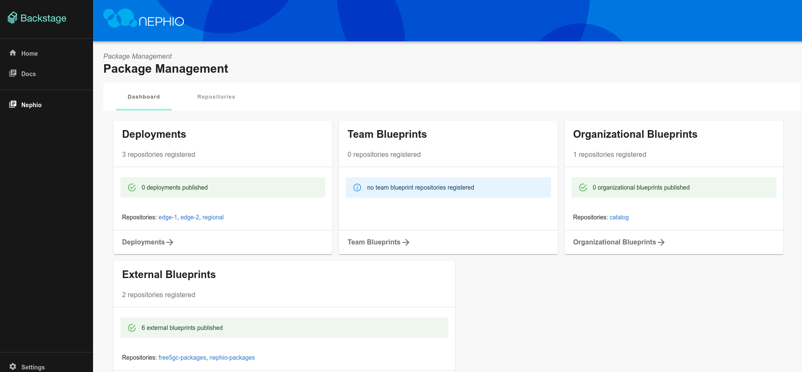

# ONE Summit 2022 Nephio Workshop

Welcome! Each participant has been provisioned a VM with a complete
simulated multi-cluster environment with the Nephio proof-of-concept code
already pre-installed, as described in our [participant VM](participant-vm.md)
page.  Please take a look at that page to get an understanding of the
environment.

The organizers will provide you with an IP address for your VM and the ssh
private key that can be used to login to the machine. You will need an ssh
client capable of port forwarding and a browser to participate in the workshop.

For the workshop exercises, you will be using both the prototype Web UI and
various `kubectl` commands run on your participant VM. To access your environment,
you will start an ssh session that will all your local laptop to access the Web
UI running in the Nephio cluster on the VM.

In all the commands below, `$IP` is the public IP address of your workshop
participant VM.

To use the UI, you need to forward ports from your workstation to the VM, and
from the VM to the Pod. The instructions below work on Linux and Mac; you will
need to consult the docs of your ssh client if you are using a Windows
machine.

```bash
# login from your workstation, forwarding 7007 -> localhost:7007 on the remote VM.
ssh -L7007:localhost:7007 -i ~/.ssh/nephio ubuntu@$IP
# now you are in the remote VM, in there run
kubectl --kubeconfig ~/.kube/nephio.config port-forward --namespace=nephio-webui svc/nephio-webui 7007
```
On your workstation you can now browse to the URL
[http://localhost:7007](http://localhost:7007), and you should see something
like the image below.



You will need to leave the port forwarding up and running in that ssh session.
So, for `kubectl` access, you need to start a second ssh session, this time
without any port forwarding. This will be used for all the CLI access to the
clusters running on the participant VM. Create a new terminal window or tab on
your laptop and run:

```bash
ssh -i ~/.ssh/nephio ubuntu@$IP
```

You can then check if you our cluster is working with `kubectl`:

```bash
ubuntu@nephio-poc-001:~$ kubectl --kubeconfig ~/.kube/nephio.config -n nephio-system get pods
NAME                                                        READY   STATUS    RESTARTS   AGE
ipam-controller-65fb5fc8d4-5m8ts                            2/2     Running   0          24m
nephio-5gc-controller-594cfd86b8-c9vbf                      2/2     Running   0          24m
nf-injector-controller-66f885d554-b6pqq                     2/2     Running   0          24m
package-deployment-controller-controller-785688cb75-nnbvt   2/2     Running   0          24m
ubuntu@nephio-poc-001:~$
```
